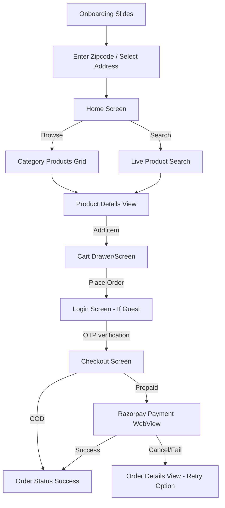

# Fresh Sabji Hub - System Blueprint & Development Guide

This document serves as a complete technical guide, database schema description, API specification, and system flow workbook. It contains all the required information to replicate the mobile application's UI/UX and features as a fully functioning responsive web application using the exact same backend and database.

---

## 1. System & Architecture Overview

The system is split into three main parts:
1. **Database**: MySQL/MariaDB relational database storing catalog data, user accounts, addresses, carts, orders, and system settings.
2. **Backend Services**: A Node.js Express server handling business logic, user auth (JWT + OTP via SMTP), distance/routing estimation (OSRM), pricing logic, push notifications (Firebase), and payment gateways (Razorpay).
3. **App/Web Client**: A React Native (Expo) app (to be copied to the web). Data is cached and state is managed on the client side using **TanStack React Query** and standard React Context API.

---

## 2. Database Schema (MySQL)

Below is the complete database schema structure including constraints, relationships, indexes, and modifications made for guest carts, delivery fees, and order payments.

### 2.1 Table Schema Details

#### `users` (User Profile Catalog)
Stores the master accounts of customers.
* `id` `INT AUTO_INCREMENT PRIMARY KEY`
* `phone_number` `VARCHAR(20) UNIQUE NULL` (Made nullable to allow email registration first)
* `first_name` `VARCHAR(100) NULL`
* `last_name` `VARCHAR(100) NULL`
* `email` `VARCHAR(255) UNIQUE NOT NULL`
* `profile_picture_url` `VARCHAR(500) NULL`
* `default_address_id` `INT NULL` (Foreign key pointing to `user_addresses.id`)
* `created_at` `TIMESTAMP DEFAULT CURRENT_TIMESTAMP`
* `updated_at` `TIMESTAMP DEFAULT CURRENT_TIMESTAMP ON UPDATE CURRENT_TIMESTAMP`

#### `otps` (Authentication Storage)
Tracks email OTP challenges for registration and logins.
* `id` `INT AUTO_INCREMENT PRIMARY KEY`
* `email` `VARCHAR(255) NOT NULL`
* `otp_code` `VARCHAR(10) NOT NULL`
* `expires_at` `TIMESTAMP NOT NULL`
* `is_used` `BOOLEAN DEFAULT FALSE`
* `created_at` `TIMESTAMP DEFAULT CURRENT_TIMESTAMP`

#### `user_addresses` (Addresses Mapping)
Stores addresses linked to users.
* `id` `INT AUTO_INCREMENT PRIMARY KEY`
* `user_id` `INT NOT NULL` (Foreign Key referencing `users.id` ON DELETE CASCADE)
* `title` `VARCHAR(50)` (Must be either `Home`, `Office`, or `Other`)
* `address_line1` `VARCHAR(255) NOT NULL` (Formatted in DB as `Flat/House No||Street/Sector Address`)
* `address_line2` `VARCHAR(255) NULL` (Landmark description)
* `city` `VARCHAR(100) NOT NULL`
* `state` `VARCHAR(100) NULL`
* `zipcode` `VARCHAR(20) NOT NULL`
* `latitude` `DECIMAL(10, 8)`
* `longitude` `DECIMAL(10, 8)`
* `is_default` `BOOLEAN DEFAULT FALSE`
* `receiver_name` `VARCHAR(100) NULL` (Name of recipient at address)
* `receiver_mobile` `VARCHAR(20) NULL` (Mobile of recipient)
* `created_at` `TIMESTAMP DEFAULT CURRENT_TIMESTAMP`
* `updated_at` `TIMESTAMP DEFAULT CURRENT_TIMESTAMP ON UPDATE CURRENT_TIMESTAMP`

#### `categories` (Item Groupings)
* `id` `INT AUTO_INCREMENT PRIMARY KEY`
* `name` `VARCHAR(100) UNIQUE NOT NULL`
* `description` `TEXT`
* `image_url` `VARCHAR(500) NULL`
* `created_at` `TIMESTAMP DEFAULT CURRENT_TIMESTAMP`
* `updated_at` `TIMESTAMP DEFAULT CURRENT_TIMESTAMP ON UPDATE CURRENT_TIMESTAMP`

#### `products` (Global Master Catalog)
* `id` `INT AUTO_INCREMENT PRIMARY KEY`
* `category_id` `INT NOT NULL` (Foreign Key referencing `categories.id` ON DELETE RESTRICT)
* `name` `VARCHAR(255) NOT NULL`
* `description` `TEXT`
* `brand` `VARCHAR(100)`
* `mrp_price` `DECIMAL(10, 2) NOT NULL`
* `discount_percentage` `DECIMAL(5, 2) DEFAULT 0.00`
* `quantity` `DECIMAL(10, 2) NOT NULL` (Size value, e.g., 500 or 1.5)
* `quantity_type` `ENUM('kg', 'g', 'mg', 'l', 'ml', 'piece', 'pack', 'dozen') NOT NULL`
* `sku` `VARCHAR(100) UNIQUE NULL`
* `image_url` `VARCHAR(500) NULL`
* `is_active` `BOOLEAN DEFAULT TRUE`
* `stock_quantity` `INT DEFAULT 100`
* `created_at` `TIMESTAMP DEFAULT CURRENT_TIMESTAMP`
* `updated_at` `TIMESTAMP DEFAULT CURRENT_TIMESTAMP ON UPDATE CURRENT_TIMESTAMP`

#### `product_features` (Key-Value Technical Attributes)
* `id` `INT AUTO_INCREMENT PRIMARY KEY`
* `product_id` `INT NOT NULL` (Foreign Key referencing `products.id` ON DELETE CASCADE)
* `feature_name` `VARCHAR(100) NOT NULL` (e.g., 'Shelf Life', 'Organic')
* `feature_value` `VARCHAR(255) NOT NULL` (e.g., '3 Days', 'Yes')
* Unique constraint: `(product_id, feature_name)`

#### `shops` (Physical Store Entities)
Shops serve as physical inventory nodes delivering to specified zip codes.
* `id` `INT AUTO_INCREMENT PRIMARY KEY`
* `name` `VARCHAR(255) NOT NULL`
* `address` `TEXT NOT NULL`
* `city` `VARCHAR(100) NOT NULL`
* `zipcode` `VARCHAR(20) NOT NULL` (Primary search index to find local shops)
* `latitude` `DECIMAL(10, 8) NOT NULL`
* `longitude` `DECIMAL(10, 8) NOT NULL`
* `is_active` `BOOLEAN DEFAULT TRUE`
* `created_at` `TIMESTAMP DEFAULT CURRENT_TIMESTAMP`
* `updated_at` `TIMESTAMP DEFAULT CURRENT_TIMESTAMP ON UPDATE CURRENT_TIMESTAMP`

#### `shop_products` (Local Shop Inventory Mapping)
Maps products available in active shops.
* `id` `INT AUTO_INCREMENT PRIMARY KEY`
* `shop_id` `INT NOT NULL` (Foreign Key referencing `shops.id` ON DELETE CASCADE)
* `product_id` `INT NOT NULL` (Foreign Key referencing `products.id` ON DELETE CASCADE)
* `is_available` `BOOLEAN DEFAULT TRUE` (Local override for stock presence)
* `created_at` `TIMESTAMP DEFAULT CURRENT_TIMESTAMP`
* `updated_at` `TIMESTAMP DEFAULT CURRENT_TIMESTAMP ON UPDATE CURRENT_TIMESTAMP`
* Unique constraint: `(shop_id, product_id)`

#### `carts` (Cart Header)
* `id` `INT AUTO_INCREMENT PRIMARY KEY`
* `user_id` `INT NULL` (Foreign Key referencing `users.id` ON DELETE CASCADE, nullable for guests)
* `guest_id` `VARCHAR(255) UNIQUE NULL` (For unauthenticated web/app visitors)
* `shop_id` `INT NOT NULL` (Foreign Key referencing `shops.id` ON DELETE CASCADE)
* `created_at` `TIMESTAMP DEFAULT CURRENT_TIMESTAMP`
* `updated_at` `TIMESTAMP DEFAULT CURRENT_TIMESTAMP ON UPDATE CURRENT_TIMESTAMP`

#### `cart_items` (Cart Lines)
* `id` `INT AUTO_INCREMENT PRIMARY KEY`
* `cart_id` `INT NOT NULL` (Foreign Key referencing `carts.id` ON DELETE CASCADE)
* `product_id` `INT NOT NULL` (Foreign Key referencing `products.id` ON DELETE CASCADE)
* `quantity` `INT NOT NULL DEFAULT 1`
* `created_at` `TIMESTAMP DEFAULT CURRENT_TIMESTAMP`
* `updated_at` `TIMESTAMP DEFAULT CURRENT_TIMESTAMP ON UPDATE CURRENT_TIMESTAMP`
* Unique constraint: `(cart_id, product_id)`

#### `banners` (Promotions)
* `id` `INT AUTO_INCREMENT PRIMARY KEY`
* `title` `VARCHAR(255) NOT NULL`
* `subtitle` `VARCHAR(255)`
* `description` `TEXT`
* `image_url` `VARCHAR(500) NOT NULL`
* `background_color` `VARCHAR(20)`
* `text_color` `VARCHAR(20)`
* `location` `VARCHAR(50) DEFAULT 'hometop'` (e.g. `'home_top'`, `'home_middle'`)
* `is_active` `BOOLEAN DEFAULT TRUE`
* `created_at` `TIMESTAMP DEFAULT CURRENT_TIMESTAMP`
* `updated_at` `TIMESTAMP DEFAULT CURRENT_TIMESTAMP ON UPDATE CURRENT_TIMESTAMP`

#### `orders` (Order Headers)
* `id` `INT AUTO_INCREMENT PRIMARY KEY`
* `order_number` `VARCHAR(50) UNIQUE NOT NULL`
* `user_id` `INT NULL` (Foreign Key referencing `users.id` ON DELETE CASCADE)
* `guest_id` `VARCHAR(255) NULL` (For guest orders, if enabled)
* `shop_id` `INT NOT NULL` (Foreign Key referencing `shops.id` ON DELETE CASCADE)
* `address_id` `INT` (Foreign Key referencing `user_addresses.id` ON DELETE SET NULL)
* `total_amount` `DECIMAL(10, 2) NOT NULL` (Calculated: Subtotal + tax_amount + delivery_fee + handling_fee + tip_amount - discount_amount)
* `tip_amount` `DECIMAL(10, 2) DEFAULT 0.00`
* `discount_amount` `DECIMAL(10, 2) DEFAULT 0.00`
* `handling_fee` `DECIMAL(10, 2) DEFAULT 0.00`
* `delivery_fee` `DECIMAL(10, 2) DEFAULT 0.00`
* `tax_amount` `DECIMAL(10, 2) DEFAULT 0.00`
* `status` `ENUM('Pending Payment', 'Processing', 'Shipped', 'Delivered', 'Cancelled') DEFAULT 'Pending Payment'`
* `payment_status` `ENUM('Pending', 'Paid', 'Failed') DEFAULT 'Pending'`
* `razorpay_order_id` `VARCHAR(255) NULL`
* `razorpay_payment_id` `VARCHAR(255) NULL`
* `razorpay_signature` `VARCHAR(255) NULL`
* `created_at` `TIMESTAMP DEFAULT CURRENT_TIMESTAMP`
* `updated_at` `TIMESTAMP DEFAULT CURRENT_TIMESTAMP ON UPDATE CURRENT_TIMESTAMP`

#### `order_items` (Order Lines)
* `id` `INT AUTO_INCREMENT PRIMARY KEY`
* `order_id` `INT NOT NULL` (Foreign Key referencing `orders.id` ON DELETE CASCADE)
* `product_id` `INT NOT NULL` (Foreign Key referencing `products.id` ON DELETE RESTRICT)
* `product_name` `VARCHAR(255) NOT NULL`
* `quantity` `INT NOT NULL`
* `price` `DECIMAL(10, 2) NOT NULL` (Purchase price per item)
* `created_at` `TIMESTAMP DEFAULT CURRENT_TIMESTAMP`

#### `payment_logs` (Transaction History Tracker)
* `id` `INT AUTO_INCREMENT PRIMARY KEY`
* `order_id` `INT NOT NULL` (Foreign Key referencing `orders.id` ON DELETE CASCADE)
* `razorpay_order_id` `VARCHAR(255) NULL`
* `razorpay_payment_id` `VARCHAR(255) NULL`
* `event_type` `VARCHAR(100) NOT NULL` (e.g. `'order_created'`, `'payment_success_verified'`, `'webhook_payment_confirmed'`)
* `payload` `TEXT NULL`
* `created_at` `TIMESTAMP DEFAULT CURRENT_TIMESTAMP`

#### `charges_config` (System Fee Settings)
Global setup (single row table with `id = 1`) to determine platform fees.
* `id` `INT AUTO_INCREMENT PRIMARY KEY`
* `delivery_base_charge` `DECIMAL(10,2)` (e.g. 30.00)
* `delivery_distance_rate` `DECIMAL(10,2)` (Rate per km, e.g. 5.00)
* `free_delivery_threshold` `DECIMAL(10,2)` (e.g. 300.00)
* `handling_fee` `DECIMAL(10,2)` (e.g. 15.00)
* `free_handling_threshold` `DECIMAL(10,2)` (e.g. 500.00)

---

## 3. Environment Configuration (`.env`)

Configure the backend variables inside `.env` on your server:
```ini
PORT=3000
DB_HOST=localhost
DB_USER=root
DB_PASSWORD=your_password
DB_NAME=grocery_db

JWT_SECRET=your_jwt_secret_key_here

# Firebase Admin Configuration (For Push Notifications)
FIREBASE_CREDENTIALS_PATH=./firebase-service-account.json

# SMTP E-mail Settings (For Sending Login OTPs)
SMTP_HOST=smtp.gmail.com
SMTP_PORT=465
SMTP_USER=no-reply@freshsabjihub.com
SUPPORT_SMTP_USER=support@freshsabjihub.com
SUPPORT_SMTP_PASS=your_smtp_app_password

# Razorpay Checkout Gateway
RAZORPAY_KEY_ID=rzp_live_XXXXXXXXXXXXXX
RAZORPAY_KEY_SECRET=XXXXXXXXXXXXXXXXXXXXX
RAZORPAY_WEBHOOK_SECRET=XXXXXXXXXXXXXXXXXX
```

---

## 4. API Specification & Payloads

All endpoints prefix: `/v1`

### 4.1 User Auth & Profile APIs

#### `POST /v1/user/auth/send-otp`
Sends a 6-digit OTP code to the user's email address.
* **Payload**:
  ```json
  {
    "email": "customer@example.com"
  }
  ```
* **Success Response (200 OK)**:
  ```json
  {
    "success": true,
    "message": "OTP sent successfully to your email"
  }
  ```

#### `POST /v1/user/auth/verify-otp`
Validates the OTP code, logs the user in (or creates their account if new), and issues a JWT token.
* **Payload**:
  ```json
  {
    "email": "customer@example.com",
    "otp": "123456"
  }
  ```
* **Success Response (200 OK)**:
  ```json
  {
    "success": true,
    "message": "Login successful",
    "data": {
      "user": {
        "id": 1,
        "email": "customer@example.com",
        "first_name": "John",
        "last_name": "Doe",
        "phone_number": "9876543210",
        "profile_picture_url": "...",
        "default_address_id": null
      },
      "token": "eyJhbGciOiJIUzI1NiIsIn..."
    }
  }
  ```

#### `GET /v1/user/auth/profile`
Fetches current authenticated profile.
* **Headers**: `Authorization: Bearer <token>`
* **Success Response (200 OK)**:
  ```json
  {
    "success": true,
    "message": "Profile fetched successfully",
    "data": { "id": 1, "email": "customer@example.com", ... }
  }
  ```

#### `PUT /v1/user/auth/profile`
Updates profile details.
* **Headers**: `Authorization: Bearer <token>`
* **Payload**:
  ```json
  {
    "name": "John Doe",
    "email": "customer@example.com",
    "phone_number": "9876543210",
    "profile_picture_url": "..."
  }
  ```
* **Success Response (200 OK)**:
  ```json
  {
    "success": true,
    "message": "Profile updated successfully",
    "data": { ... }
  }
  ```

#### `POST /v1/user/auth/upload`
Uploads profile picture using Form-Data.
* **Headers**: `Authorization: Bearer <token>`, `Content-Type: multipart/form-data`
* **Payload**: Multipart file containing file key `avatar`.
* **Success Response (200 OK)**:
  ```json
  {
    "success": true,
    "message": "Avatar uploaded successfully",
    "data": {
      "url": "http://<server-ip>:<port>/uploads/avatar-1709491823.jpg"
    }
  }
  ```

#### `GET /v1/user/auth/addresses`
* **Headers**: `Authorization: Bearer <token>`
* **Success Response (200 OK)**: Array of user addresses.

#### `POST /v1/user/auth/addresses`
Saves or edits address. Title can be `Home`, `Office`, or `Other`.
* **Headers**: `Authorization: Bearer <token>`
* **Payload**:
  ```json
  {
    "title": "Home",
    "address_line1": "Flat 404||Sector 62",
    "address_line2": "Near Subway",
    "city": "Noida",
    "state": "Uttar Pradesh",
    "zipcode": "10001",
    "latitude": 28.62,
    "longitude": 77.38,
    "is_default": true,
    "receiver_name": "John Doe",
    "receiver_mobile": "9876543210"
  }
  ```
* **Success Response (201 Created)**:
  ```json
  {
    "success": true,
    "message": "Address saved successfully",
    "data": {
      "id": 14
    }
  }
  ```

#### `DELETE /v1/user/auth/addresses/:id`
Deletes specified address.
* **Headers**: `Authorization: Bearer <token>`
* **Success Response (200 OK)**

---

### 4.2 Catalog APIs

#### `GET /v1/user/catalog/banners`
Gets promotional offer banners.
* **Success Response (200 OK)**:
  ```json
  {
    "success": true,
    "message": "Banners fetched successfully",
    "data": [
      {
        "id": 1,
        "title": "Fresh Vegetables",
        "subtitle": "Get up to 20% off",
        "description": "Daily organic greens",
        "image_url": "/uploads/banners/veg.png",
        "background_color": "#E8F5E9",
        "text_color": "#2E7D32",
        "location": "hometop",
        "is_active": 1
      }
    ]
  }
  ```

#### `GET /v1/user/catalog/categories`
Gets categories list. Optional parameter `shopId` will return only categories that have products mapped to that shop's inventory.
* **Query Parameters**: `shopId` (optional)
* **Success Response (200 OK)**

#### `GET /v1/user/catalog/shop-by-zipcode/:zipcode`
Locates the active shop delivering to the customer's zipcode.
* **Success Response (200 OK)**:
  ```json
  {
    "success": true,
    "message": "Shop fetched successfully",
    "data": {
      "id": 1,
      "name": "Main Warehouse Noida",
      "address": "Sector 62, Block C",
      "city": "Noida",
      "zipcode": "10001",
      "latitude": "28.62890000",
      "longitude": "77.38010000"
    }
  }
  ```
* **Error Response (404 Not Found)**:
  ```json
  {
    "success": false,
    "message": "No service available at this location"
  }
  ```

---

### 4.3 Shop Inventory API

#### `GET /v1/user/shop-inventory/:shopId`
Fetches all products mapped to the selected shop.
* **Success Response (200 OK)**:
  ```json
  {
    "success": true,
    "message": "Inventory fetched successfully",
    "data": [
      {
        "product_id": 1,
        "product_name": "Fresh Tomato",
        "category_id": 2,
        "price": "40.00",
        "discount_percentage": "10.00",
        "quantity": "500.00",
        "quantity_type": "g",
        "image_url": "/uploads/products/tomato.jpg",
        "is_available": 1
      }
    ]
  }
  ```

---

### 4.4 Cart APIs

#### `GET /v1/user/cart`
Calculates and returns complete cart states, pricing breakdown, and free shipping limits.
* **Query Parameters**:
  - `userId` (Optional if not logged in)
  - `guestId` (Required if `userId` is absent)
  - `shopId` (Required for shipping calculations)
  - `addressId` (Optional - for distance checks)
* **Success Response (200 OK)**:
  ```json
  {
    "success": true,
    "message": "Cart fetched successfully",
    "data": {
      "id": 2,
      "user_id": 1,
      "guest_id": null,
      "items": [
        {
          "id": 5,
          "product_id": 1,
          "quantity": 2,
          "price": "40.00",
          "name": "Fresh Tomato",
          "brand": "Organic",
          "size": "500.00",
          "quantity_type": "g",
          "image_url": "...",
          "discount_percentage": "10.00",
          "is_available": 1
        }
      ],
      "pricing": {
        "subtotal": 72.00,
        "savings": 8.00,
        "deliveryFee": 35.00,
        "handlingFee": 15.00,
        "grandTotal": 122.00,
        "freeDeliveryThreshold": 300,
        "freeHandlingThreshold": 500,
        "distanceKm": 1.2
      }
    }
  }
  ```

#### `POST /v1/user/cart/add` (or `/v1/user/cart/items` for compatibility)
* **Payload**:
  ```json
  {
    "shopId": 1,
    "productId": 1,
    "quantity": 1,
    "userId": 1,      // optional
    "guestId": "guest_xxxx" // required if userId absent
  }
  ```

#### `PUT /v1/user/cart/update` (or `/v1/user/cart/items/:itemId`)
* **Payload**:
  ```json
  {
    "itemId": 5, // cart_items.id
    "quantity": 3
  }
  ```

#### `DELETE /v1/user/cart/remove` (or `/v1/user/cart/items/:itemId`)
Removes an item from the cart. Requires `itemId` parameter.

#### `POST /v1/user/cart/merge`
Merges guest cart items into user cart upon login.
* **Payload**:
  ```json
  {
    "userId": 1,
    "guestId": "guest_abc123"
  }
  ```

---

### 4.5 Order APIs

#### `POST /v1/user/orders`
Creates a new order. If payment method is not COD, returning response includes Razorpay Order credentials.
* **Headers**: `Authorization: Bearer <token>`
* **Payload**:
  ```json
  {
    "shopId": 1,
    "addressId": 14,
    "totalAmount": 137.00,
    "tipAmount": 20.00,
    "discountAmount": 0.00,
    "handlingFee": 15.00,
    "deliveryFee": 30.00,
    "paymentMethod": "upi", // 'cod', 'upi', 'gpay', 'phonepe', etc.
    "items": [
      { "productId": 1, "quantity": 2 }
    ]
  }
  ```
* **Success Response (Prepaid Order pending Payment - 201 Created)**:
  ```json
  {
    "success": true,
    "message": "Order created, payment pending",
    "data": {
      "orderId": 45,
      "orderNumber": "ORD849201",
      "status": "Pending Payment",
      "createdAt": "2026-06-18T19:55:28.000Z",
      "paymentRequired": true,
      "razorpayOrderId": "order_NXK109DKD83",
      "amount": 137.00,
      "amountPaise": 13700,
      "razorpayKeyId": "rzp_test_XXXXXX"
    }
  }
  ```
* **Success Response (Cash On Delivery - 201 Created)**:
  ```json
  {
    "success": true,
    "message": "Order created successfully",
    "data": {
      "orderId": 46,
      "orderNumber": "ORD849202",
      "status": "Processing",
      "createdAt": "2026-06-18T19:56:00.000Z",
      "paymentRequired": false
    }
  }
  ```

#### `POST /v1/user/orders/verify`
Confirms signature of successful online payments on server-side.
* **Headers**: `Authorization: Bearer <token>`
* **Payload**:
  ```json
  {
    "orderId": 45,
    "razorpayPaymentId": "pay_NKX901831",
    "razorpayOrderId": "order_NXK109DKD83",
    "razorpaySignature": "48109d...signature_hash..."
  }
  ```
* **Success Response (200 OK)**:
  ```json
  {
    "success": true,
    "message": "Payment verified and order confirmed successfully",
    "data": {
      "orderId": 45,
      "orderNumber": "ORD849201",
      "status": "Processing",
      "paymentStatus": "Paid"
    }
  }
  ```

#### `POST /v1/user/orders/:id/retry`
Creates a fresh Razorpay order ID to retry payment for a previously failed/cancelled order.
* **Headers**: `Authorization: Bearer <token>`
* **Success Response (200 OK)**: Returns new `razorpayOrderId` and payment metadata details.

---

### 4.6 Support API

#### `POST /v1/user/support/query`
* **Headers**: `Authorization: Bearer <token>` (Optional)
* **Payload**:
  ```json
  {
    "subject": "Delay in delivery",
    "description": "My order ORD849201 has not arrived yet.",
    "name": "John",
    "email": "customer@example.com",
    "phone": "9876543210"
  }
  ```
* **Success Response (200 OK)**

---

### 4.7 Notification API

#### `POST /v1/user/token/register`
* **Headers**: `Authorization: Bearer <token>` (Optional)
* **Payload**:
  ```json
  {
    "token": "fcm_device_registration_token_string"
  }
  ```
* **Success Response (200 OK)**

---

### 4.8 Admin Dashboard & Operations APIs

* **Admin Authentication**: Standard JWT login via `POST /v1/admin/auth/login` returning token.
* **Admin routes**:
  - `GET /v1/admin/dashboard/stats`: Returns KPI summaries (Active orders, total sales, revenue, new customers, active products) & time-series data.
  - `GET /v1/admin/categories` / `POST /v1/admin/categories` / `PUT /v1/admin/categories/:id` / `DELETE /v1/admin/categories/:id`
  - `GET /v1/admin/products` / `POST /v1/admin/products` / `PUT /v1/admin/products/:id` / `DELETE /v1/admin/products/:id`
  - `GET /v1/admin/shops` / `POST /v1/admin/shops` / `PUT /v1/admin/shops/:id` / `DELETE /v1/admin/shops/:id`
  - `GET /v1/admin/shop-inventory/:shopId`: Fetch shop inventory.
  - `PUT /v1/admin/shop-inventory/toggle`: Toggles availability of product. Payload: `{ shopId, productId, isAvailable }`.
  - `GET /v1/admin/orders` / `PUT /v1/admin/orders/:id` (Updates status to `Processing`, `Shipped`, `Delivered`, `Cancelled`).
  - `GET /v1/admin/banners` / `POST /v1/admin/banners` / `PUT /v1/admin/banners/:id`
  - `GET /v1/admin/charges`: Gets `charges_config`.
  - `PUT /v1/admin/charges`: Edits charges config rates.
  - `POST /v1/admin/upload`: Uploads catalog pictures.

---

## 5. Core Business Logic & Pricing Formulas

### 5.1 Distance Calculation
The backend uses **OSRM (Open Source Routing Machine)** driving distance API:
```
GET http://router.project-osrm.org/route/v1/driving/{shopLon},{shopLat};{userLon},{userLat}?overview=false
```
* **Fallback**: If OSRM times out or is offline, it calculates the straight-line distance using the **Haversine formula** and multiplies by a **1.4x factor** to approximate winding road detours.

### 5.2 Dynamic Cart Pricing Calculation
The pricing engine computes numbers in the database layer as follows:
1. **Subtotal**: Sum of `quantity * discountPrice` for all available items.
   - *Discount Price* is computed as `mrp_price - (mrp_price * (discount_percentage / 100))`.
   - The app applies a default 10% discount on orders when creating them (see `orderModel.js`).
2. **Delivery Fee**:
   - If `subtotal >= free_delivery_threshold` -> Delivery fee = `0`.
   - Else -> Delivery fee = `delivery_base_charge + (distance_km * delivery_distance_rate)`.
3. **Handling Fee**:
   - If `subtotal >= free_handling_threshold` -> Handling fee = `0`.
   - Else -> Handling fee = `handling_fee`.
4. **GST Tax**: Standard 5% GST is computed on the subtotal.
5. **Grand Total**: `Subtotal + GST Tax + Delivery Fee + Handling Fee + Driver Tip - Promo Discount`.

---

## 6. Mobile App Workflows & Screens

Below is the step-by-step navigational schema of the React Native client. Replicate these screen views on the web layout:



### 6.1 Description of Pages and Features

1. **Onboarding / Launch**:
   - Carousel with beautiful vegetable banners. Saves onboarding completion flag in LocalStorage.
2. **Address Setup**:
   - Form fields: receiver name, mobile number, flat/house number, sector address, landmark, and zipcode.
   - Coordinates (latitude/longitude) can be chosen on map widgets or mock coordinates.
   - Active address is stored locally.
3. **Home View**:
   - Delivery ETA display (calculates minutes: distance in km * 5 mins/km, rounded).
   - Sticky header search bar with mic icon.
   - Banner sliders (Home Top / Home Middle).
   - "Shop by Category" circular grid.
   - Multi-category horizontal item carousels with "Add to Cart" counter buttons.
4. **Live Search**:
   - Searches items instantly when query length >= 2. Returns item name, thumbnail, price, and maps directly to detail view.
5. **Product Details Screen**:
   - High-res images, brand names, product description, nutritional facts, list of custom product features, and related recipes.
6. **Cart Screen**:
   - List of items with active counters.
   - "Before you checkout" driver tip options (e.g. ₹10, ₹20, ₹35, ₹50).
   - Billing breakdown list.
7. **Checkout Screen**:
   - Address preview card.
   - Payment method toggle modal (COD or Razorpay Prepaid options like GPay, PhonePe, Card, Netbanking).
8. **Payment WebView**:
   - Opens checkout page loading the official Razorpay JS SDK overlay.
   - Seamlessly handles Android/iOS payment app intents (e.g., redirecting to GPay app) or falls back to a sandbox transaction simulator if live credentials are not set.
9. **Order History**:
   - Tab showing order summary list. Reorder option fetches current shop inventory, filters available items, and batch-adds them back into the cart.
10. **Order Tracking**:
    - Status progress bar (`Pending Payment` -> `Processing` -> `Shipped` -> `Delivered`).
    - Option to cancel order (if still processing) or retry payment if failed.

---

## 7. Recommendations for Rebuilding as a Web Application

To create a website that shares the backend and feels identical to the mobile application:

### 7.1 Client-Side Tech Stack
* **Framework**: React.js with **Next.js** (recommended for SEO, SSR category pages) or **Vite** (for a fast single-page app).
* **Styling**: Tailwind CSS (easy matching of layout styles) or Styled Components.
* **Icons**: Use `lucide-react` (direct counterpart of `lucide-react-native` used in the app).

### 7.2 Porting State Management
* **React Query**: Keep TanStack React Query (`@tanstack/react-query`) configuration exactly the same. Keep cache staleTimes at 5 minutes to avoid redundant server roundtrips.
* **Authentication Context**: Store the JWT token in standard browser HTTP Cookies (with `SameSite=Strict` for security) or `localStorage`.
* **Guest Cart Storage**: Generate a unique random string (e.g. `guest_s8d1j2d89s...`) and store it in `localStorage` to preserve visitors' carts across sessions.

### 7.3 Direct Web Payment SDK
Unlike React Native which requires a WebView wrapper to load Razorpay, on the web you can integrate Razorpay's standard checkout script directly inside your pages:
```html
<script src="https://checkout.razorpay.com/v1/checkout.js"></script>
```
Pass the `razorpayOrderId`, amount in paise, and callbacks directly in JavaScript to trigger the native modal overlay.
